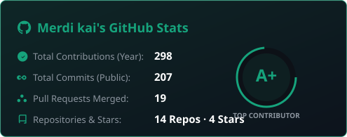
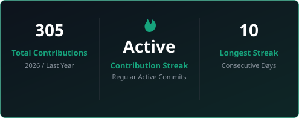
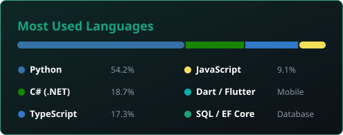
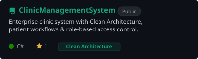
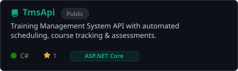
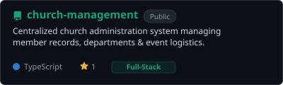
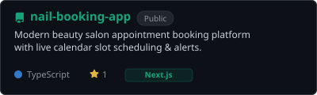
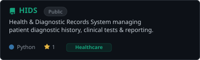

<div align="center">


</div>

<div align="center">

[](https://git.io/typing-svg)

</div>

<br/>

<div align="center">

<a href="https://github.com/Merdikai/Merdekiyos-Tasew-Portofolio"></a>
&nbsp;
<a href="mailto:merdekiyostasew@gmail.com"></a>
&nbsp;
<a href="https://linkedin.com/in/merdekiyos-tasew"></a>

<br/><br/>

<a href="https://github.com/Merdikai"></a>
&nbsp;
<a href="https://t.me/Merdi27"></a>

</div>

<br/>

<div align="center">
  
  &nbsp;
  
  &nbsp;
  
  &nbsp;
  
</div>

---


##  &nbsp; About Me


I'm a passionate **Full-Stack & App Developer** and **Computer Science Graduate** based in **Addis Ababa, Ethiopia** 🇪🇹.

I specialize in building scalable web backends, responsive modern frontends, and cross-platform mobile apps using clean architecture, structured design patterns, and robust software engineering practices.

- 🔭 &nbsp; Currently building **scalable full-stack web and mobile systems** (.NET, Angular, React, Flutter)
- 🌱 &nbsp; Continuously expanding expertise in **Clean Architecture, Microservices & Cloud Platforms**
- 💼 &nbsp; Completed an engineering internship at **PEDS** and delivered real-world enterprise applications
- 💬 &nbsp; Ask me about **C#, ASP.NET Core, Angular, React, TypeScript, Flutter, Python, SQL**
- ⚡ &nbsp; Fun fact: Passionate about crafting high-performance APIs and sleek, responsive user interfaces

<br clear="right"/>

```typescript
const merdekiyos: Developer = {
  name:       "Merdekiyos Tasew",
  location:   "Addis Ababa, Ethiopia 🇪🇹",
  role:       "Full-Stack & App Developer",
  education:  "B.Sc. in Computer Science",
  languages:  ["C#", "TypeScript", "JavaScript", "Dart", "SQL"],
  frameworks: [".NET / ASP.NET Core", "Angular", "React", "Flutter"],
  databases:  ["SQL Server", "PostgreSQL", "MySQL"],
  interests:  ["Clean Architecture", "Mobile Development", "System Design"],
  available:  true, // Open to opportunities & collaborations!
}
```


##  &nbsp; Tech Stack

<div align="center">

**— Frontend & Mobile —**


<br/><br/>

**— Backend & Database —**


<br/><br/>

**— Tools & Platforms —**


</div>

<br/>

<div align="center">

| Category | Technologies |
|:---:|:---|
| **Backend** | C# · ASP.NET Core · Web API · Entity Framework Core · Clean Architecture · Node.js |
| **Frontend** | Angular · React · Next.js · TypeScript · JavaScript · Tailwind CSS · HTML5 · CSS3 |
| **Mobile** | Flutter · Dart · Cross-Platform App Development |
| **Databases** | Microsoft SQL Server · PostgreSQL · supabase · MySQL |
| **Tools & DevOps** | Git · GitHub · Docker · Postman · swagger · Scalar · VS Code · Visual Studio |

</div>


##  &nbsp; GitHub Stats

<div align="center">
  
  &nbsp;
  
  &nbsp;
  
  &nbsp;
  
  &nbsp;
  
</div>

<br/>

<div align="center">


&nbsp;


<br/><br/>



</div>


##  &nbsp; Featured Projects

<div align="center">

<a href="https://github.com/Merdikai/ClinicManagementSystem"></a>
&nbsp;
<a href="https://github.com/Merdikai/TmsApi"></a>

<br/><br/>

<a href="https://github.com/Merdikai/church-management"></a>
&nbsp;
<a href="https://github.com/Merdikai/nail-booking-app"></a>

<br/><br/>

<a href="https://github.com/Merdikai/HIDS"></a>

</div>

<br/>

<div align="center">

| 🚀 Project | 📝 Description | 🛠 Stack | 🔗 |
|:---|:---|:---|:---:|
| **Clinic Management System** | Enterprise clinic system with Clean Architecture, patient workflows & role-based security | C# · ASP.NET Core · Clean Architecture · SQL Server | [↗](https://github.com/Merdikai/ClinicManagementSystem) |
| **Training Management (TMS)** | Enterprise training platform with automated scheduling, course tracking & assessments | ASP.NET Core · Angular · TypeScript · EF Core | [↗](https://github.com/Merdikai/TmsApi) |
| **Church Management System** | Centralized administration platform managing member records, departments & events | TypeScript · Full-Stack · SQL | [↗](https://github.com/Merdikai/church-management) |
| **Health Diagnostic (HIDS)** | Clinical health & diagnostic records system supporting patient diagnostic workflows | Python · Full-Stack | [↗](https://github.com/Merdikai/HIDS) |
| **Nail Booking Platform** | Interactive appointment booking platform with real-time slot scheduling & notifications | TypeScript · Next.js · Tailwind CSS | [↗](https://github.com/Merdikai/nail-booking-app) |

</div>


##  &nbsp; My Journey

<div align="center">

```
┌─────────────────────────────────────────────────────────────────┐
│                                                                 │
│   2022  🌱  Started Computer Science — foundational algorithms   │
│   2023  🚀  Deep into OOP, C#, Web Tech & Relational Databases  │
│   2024  ⚡  Building full-stack web, mobile apps & Clean Arch    │
│   2025  💼  PEDS Internship — enterprise software engineering    │
│   2026  🎓  Computer Science Graduation & Scalable Systems      │
│   Future 🌟 High-impact systems, cloud solutions & open source   │
│                                                                 │
└─────────────────────────────────────────────────────────────────┘
```

</div>


## ✨ &nbsp; Fun Facts & Highlights

<div align="center">

| | |
|:---:|:---|
| 🇪🇹 | Based in **Addis Ababa, Ethiopia**, passionate about engineering scalable solutions |
| 🏗️ | Strong proponent of **Clean Architecture**, SOLID principles, and clean readable code |
| 📱 | Multi-platform builder across **Web (.NET, Angular, React)** and **Mobile (Flutter)** |
| 🎯 | Dedicated to turning complex business logic into smooth, intuitive user experiences |
| ⚡ | Quick problem solver who thrives debugging intricate full-stack workflows |
| 🌙 | High-focus builder who loves quiet late-night coding sessions |

</div>

<br/>

<div align="center">

**What I'm like to work with:**


&nbsp;

&nbsp;

&nbsp;


</div>


## 📬 &nbsp; Let's Connect

<div align="center">


**I'm always open to discussing new opportunities, projects, collaborations, or tech discussions.**

<br/>

<a href="mailto:merdekiyostasew@gmail.com">
  
</a>
&nbsp;
<a href="https://t.me/Merdi27">
  
</a>
&nbsp;
<a href="https://linkedin.com/in/merdekiyos-tasew">
  
</a>
&nbsp;
<a href="tel:+251953913418">
  
</a>

<br/><br/>


*"Clean code always looks like it was written by someone who cares."*

</div>

<br/>


